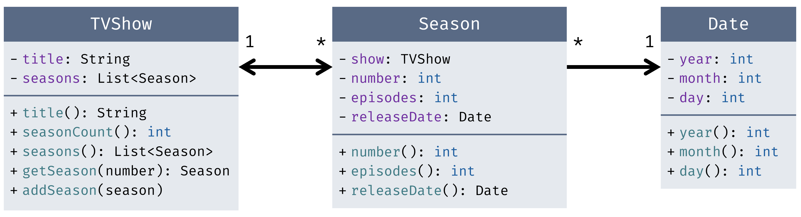

# Probe-Midterm-Prüfung 2, OOPI2

Dieses Projekt enthält eine alte Midterm-Prüfung, die Sie für einen Probelauf vor der zweiten Midterm-Prüfung verwenden können. Es empfiehlt sich, diese Aufgaben unter Prüfungsbedingungen zu lösen:
    
- Die Aufgaben sind auf eine Prüfungszeit von 60 bis 75 Minuten ausgelegt. (Die originale Prüfung dauerte 90 Minuten aber enthielt einen zusätzlichen Papierteil.)

- Verwenden Sie keine Hilfsmittel, die nicht auch in der Prüfung erlaubt sind, also keine Internetrecherche, keine Kommunikation mit anderen Personen und keine KI-Assistenten. Stellen Sie Ihre Unterlagen vor dem Lösen dieser Probeprüfung zusammen und verwenden Sie nur diese.

## Allgemeine Hinweise

- Sie können die Aufgaben in beliebiger Reihenfolge lösen.
- Sie brauchen keine neuen Klassen zu erstellen, sondern sollen die vorgegebenen Klassen erweitern.

## Aufgaben

Diese Prüfung besteht aus 4 Aufgaben. Insgesamt sind 90 Punkte möglich. Die Aufgabenstellungen sind in diesem README erklärt und durch die JUnit-Tests spezifiziert.

### Übersicht Aufgaben 1 bis 3

In den folgenden drei Aufgaben kommen folgende Klassen im Package `tv` zum Einsatz, welche Fernsehserien (`TVShow`), Staffeln (`Season`) und Datumsabgaben (`Date`) repräsentieren:

### 1. Sortieren (10 Punkte)

Implementieren Sie die Methode `sortByReleaseDateInYear` in der Klasse `SeasonSorter` im Package `sort`. Diese Methode sortiert eine gegebene Liste von Staffeln (`Season`) danach, _wie früh im Jahr_ eine Staffel veröffentlicht wurde. Wenn z. B. eine Staffel A am 12.02.2023 und eine Staffel B am 27.01.2024 veröffentlicht wurde, zählt Staffel B als die frühere, denn das Jahr wird nicht berücksichtigt.

Falls mehrere Staffeln am selben Tag veröffentlicht wurden, gelten Sie als «gleich» und sollen nicht umsortiert werden (relativ zueinander).

### 2. Streams (40 Punkte)

Die Klasse `TVDB` repräsentiert eine Datenbank von Fernsehserien (`TVShow`) und soll folgende Methoden zur Analyse der hinterlegten Serien anbieten:

- `seasonsPerShow()`: 10 Punkte
- `showsWithMostSeasons(int)`: 15 Punkte
- `maxEpisodesPerSeason()`: 15 Punkte

Diese Methoden müssen deklarativ mit Streams implementiert werden, um Punkte zu erhalten; Schleifen (oder `forEach` o. ä.) sind nicht erlaubt. Andere Anweisungen wie `if`, Zuweisungen zu Variablen, usw. sind aber erlaubt.

### 3. Beobachter (20 Punkte)

Erweitern Sie die Klasse `TVShow` im Package `tv` um einen Mechanismus, der es erlaubt, Codestücke als «Beobachter» zu registrieren; diese werden benachrichtigt, wenn eine neue Staffel (`Season`) zu der Serie hinzugefügt wird.

Unten in dieser Klasse `TVShow` befindet sich ein `// TODO`-Kommentar mit einem Beispiel-Aufruf. Zudem sind eine Reihe von Unit-Tests vorgegeben, welche zu Beginn teilweise auskommentiert sind.

Die Klassen `Season` und `Date` sollen nicht verändert werden. Achten Sie zudem darauf, dass Sie die Klasse `TVShow` nicht aus Versehen «kaputt machen», sodass die Tests für Aufgabe 2 nicht mehr laufen.

### 4. Lambda-Ausdrücke (20 Punkte)

In der Klasse `Lambdas` im Package `lambda` sind zwei Methoden vorgegeben, die Sie implementieren sollen:

- `increaseFullTimeSalaries(Map<Employee, Double>, int)`: 10 Punkte
- `accessedFilesPerEmployee(List<LogEntry>)`: 10 Punkte

Bei beiden ist vorgegeben, dass Sie eine bestimmte Methode von `Map` und einen Lambda-Ausdruck verwenden müssen. Falls Sie diese Methoden noch nicht kennen, verwenden Sie die Java-Dokumentation, um mehr über die entsprechende Methode und den benötigten Lambda-Ausdruck zu erfahren.