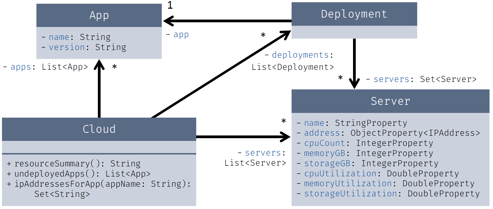

# OOPI2 MSP HS 2021 – Programmierteil

In diesen Aufgaben geht es um Programme zum Verwalten von Apps und Servern in einer Cloud. Die Model-Klassen befinden sich im Package `oop2.msp.model` und beinhalten die Klassen `App` und `Server` und zusätzlich die Klasse `Deployment`, welche die Informationen enthält, auf welchen Servern eine bestimmte App zurzeit «deployt» ist.

## Streams & Collections

In der Klasse `Cloud` gibt es drei Methoden, welche Sie ausfüllen sollen. Lesen Sie die Methodenbeschreibungen und die dazugehörigen Unit-Tests, um zu verstehen, was diese Methoden genau machen sollen. Verwenden Sie die drei vordefinierten Listen `servers`, `apps` und `deployments` um die Methoden zu implementieren. Alle kann man sauber mit Streams lösen.

Verändern Sie im Package `oop2.msp.model` ausschliesslich die Klasse `Cloud` und nur unterhalb von `------------` (abgesehen von den Imports, welche Sie beliebig ändern dürfen).

## I/O

Im Package `oop2.msp.io` befindet sich die Klasse `ServerIO`, mit zwei vordefinierten Methoden `readCsv` und `writeCsv`. Implementieren Sie diese Methoden so, dass sie eine Liste von `Server`-Objekten aus einem CSV-Text einlesen, bzw. eine solche Liste als CSV-Text ausgeben. Das Format eines solchen Texts entspricht dem folgenden Beispiel:

    Name;IP Address;CPU count;Memory;Storage
    remifushi;192.168.50.110;64;512 GB;8 TB
    mafushi;192.168.45.100;16;64 GB;500 GB
    kanifushi;192.168.45.103;32;64 GB;500 GB
    creek;192.168.40.100;8;32000 MB;200 GB

Beachten Sie, dass bei den Spalten `Memory` und `Storage` nicht nur `GB`, sondern auch `MB` und `TB` als Einheiten vorkommen können. Dies ist allerdings nur beim Einlesen relevant; beim Ausgeben sollen Sie überall `GB` verwenden.

Die Methoden arbeiten mit einem `Input`-, bzw. `OutputStream`, nicht direkt mit Dateipfaden. Das macht die Methoden vielseitiger einsetz- und vor allem einfacher testbar. Stellen Sie sicher, dass der gegebene Stream jeweils am Ende der Ausführung der Methoden geschlossen wird.

Für diese Aufgabe gibt es ebenfalls Unit-Tests, an denen Sie sich beim Implementieren der Methoden orientieren sollen.
