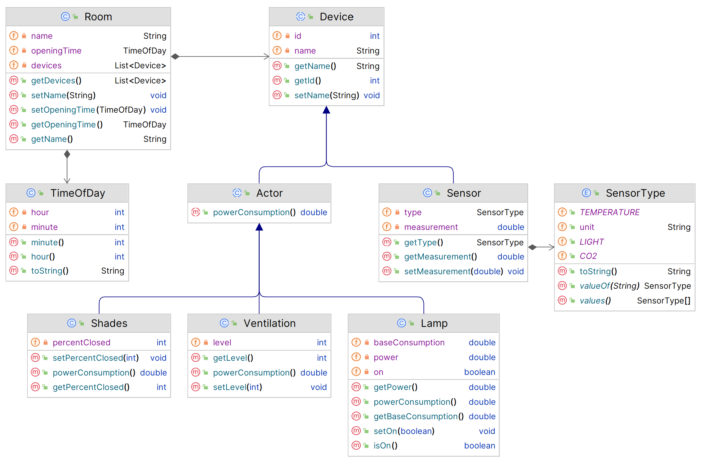

# OOPI2 MSP HS 2023 – Programmierteil

Sämtliche Programmieraufgaben beziehen sich auf die Klassen in folgendem Diagramm. Es handelt sich um eine Weiterentwicklung der Klassen in Aufgabe 2. Die Konstruktoren wurden für eine bessere Lesbarkeit weggelassen.

## 5. Collections (22 Punkte)

Implementieren Sie folgende beiden Methoden in der Klasse `Campus`. _Diese Methode dürfen mit oder ohne Streams implementiert werden._

* `totalPowerConsumptionForRoom`: Gibt den gesamten Stromverbrauch (`powerConsumption`) aller Aktoren im Raum mit dem gegebenen Namen zurück. Falls kein Raum mit dem gegebenen Namen existiert, wird eine `IllegalArgumentException` geworfen.

* `allOpeningHours`: Gibt ein Set mit den Öffnungszeiten aller Räume im Campus zurück. Die Öffnungszeiten werden als `TimeOfDay`-Objekte zurückgegeben, wobei eine bestimmte Öffnungszeit, z. B. 08:30, nur einmal im Set vorkommen darf. Ausnahmsweise ist hier als Rückgabetyp eine konkrete Set-Implementation vorgegeben, nämlich `HashSet`. Passen Sie die Klasse `TimeOfDay` entsprechend an und implementieren Sie anschliessend diese Methode. Beachten Sie, dass bestimmte Räume keine Öffnungszeit (`null`) haben können. Diese Räume sollen ignoriert werden.

  **Tipp:** Da der Rückgabetyp `HashSet` und nicht `Set` ist, ist eine Stream-Lösung nicht ganz offensichtlich.

## 6. Streams (20 Punkte)

Implementieren Sie die nächsten beiden Methoden. _Diese Methoden müssen jeweils mit genau einer Stream-Pipeline implementiert werden. Lösungen, die mehrere Pipelines, `forEach` oder Schleifen verwenden, erhalten keine Punkte._

* `roomsWithFewestDevices`: Findet die (höchstens) `n` Räume im Campus mit den wenigsten Geräten und gibt deren Namen zurück. Die Namen werden als Liste zurückgegeben, wobei die Räume mit den wenigsten Geräten zuerst in der Liste erscheinen. Falls mehrere Räume gleich viele Geräte haben, können diese in beliebiger Reihenfolge in der Liste erscheinen. Falls es weniger als `n` Räume gibt, werden entsprechend weniger Namen zurückgegeben.

* `countSensorsByType`: Zählt, wie viele Sensoren von dem gegebenen Sensortyp im Campus vorhanden sind.

## 7. I/O (20 Punkte)

Implementieren Sie die nächste Methode `readOpeningHours`. Diese liest aus dem gegebenen `InputStream` die Öffnungszeiten der Räume im Campus ein und speichert sie direkt in die `Room`-Objekte mit den entsprechenden Namen. Es wird davon ausgegangen, dass keine zwei Räume mit gleichem Namen existieren. Falls für einen Raum bereits eine Öffnungszeit existiert, wird diese durch die neue Öffnungszeit ersetzt. Falls für einen bestimmten Raum keine Öffnungszeit in der Datei angegeben ist, bleibt dessen Öffnungszeit unverändert.

Der `InputStream` liefert den Inhalt einer Textdatei, welche z. B. folgenden Inhalt haben könnte:

    Mensa         08:30
    Bibliothek    09:00
    Studiensaal A 08:00
    Studiensaal B 08:00
    Sekretariat   08:45

 Jede Zeile enthält den Namen eines Raums und die Öffnungszeit des Raums. Die beiden Werte sind durch ein oder mehrere Leerzeichen getrennt. Der Name eines Raums kann ebenfalls Leerzeichen enthalten, aber das letzte Leerzeichen in einer Zeile steht immer direkt vor der Öffnungszeit. Die Öffnungszeiten sind im Format `HH:MM` angegeben. Für ungültige Zeilen (fehlende oder ungültige Öffnungszeit, nicht existierender Raum) wird eine `ParseException` aus dem Package `smartcampus` geworfen.
 
Die Textdatei ist in UTF-8 kodiert; stellen Sie sicher, dass garantiert der korrekte Zeichensatz verwendet wird und dass der `InputStream` am Ende auf jeden Fall geschlossen wird.

## 8. Callbacks & Lambdas (22 Punkte)

In dieser Aufgabe sollen Sie die Klasse `Campus` um eine Möglichkeit erweitern, _Automationen_ zu installieren. Eine Automation ist ein Objekt, bzw. ein Codestück, das zu bestimmten Tageszeiten bestimmte Aktionen ausführt.

* Fügen Sie eine Methode `installAutomation` zu `Campus` hinzu, die eine Automation als Argument nimmt und diese in einer Liste von Automationen im `Campus`-Objekt speichert. Der Parametertyp soll so gewählt sein, dass die Lambda-Ausdrücke in der Klasse `AutomationTest` funktionieren. (Die Tests sind zu Beginn auskommentiert.) Sie dürfen dazu entweder ein Funktionsinterface aus der Java-Standardbibliothek verwenden oder ein eigenes Funktionsinterface definieren. (Falls Sie ein eigenes Interface definieren, achten Sie darauf, es im «src»-Ordner, nicht im «test»-Ordner zu erstellen.)

  Fügen Sie anschliessend noch eine Methode `performAutomations` hinzu, welche alle installierten Automationen mit der als Parameter spezifizierten Uhrzeit ausführt. Beachten Sie die Unit-Tests für weitere Details.

* Implementieren Sie die Methode `newOpenCloseAutomation` in der Klasse `ShadesAutomations`. Diese erstellt eine Automatisierung, welche alle Storen im Campus morgens um 6 Uhr öffnet und abends um 20:30 Uhr schliesst. Beachten Sie, dass Sie dazu noch den Rückgabetyp ändern müssen, sodass er zu Ihrer Lösung der vorherigen Teilaufgabe passt. Beachten Sie auch die (ebenfalls zu Beginn auskommentierten) Unit-Tests für weitere Details.

  **Wichtig:** Die Automatisierung muss mit einem Lambda-Ausdruck implementiert werden, um die volle Punktzahl zu erhalten. Lösungen ohne Lambda-Ausdruck geben maximal die Hälfte der Punkte.